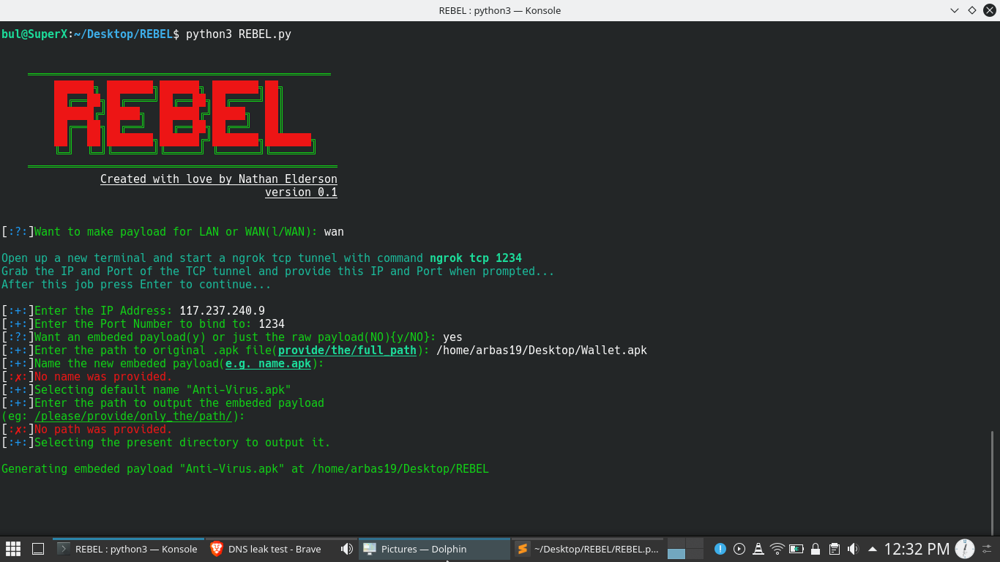
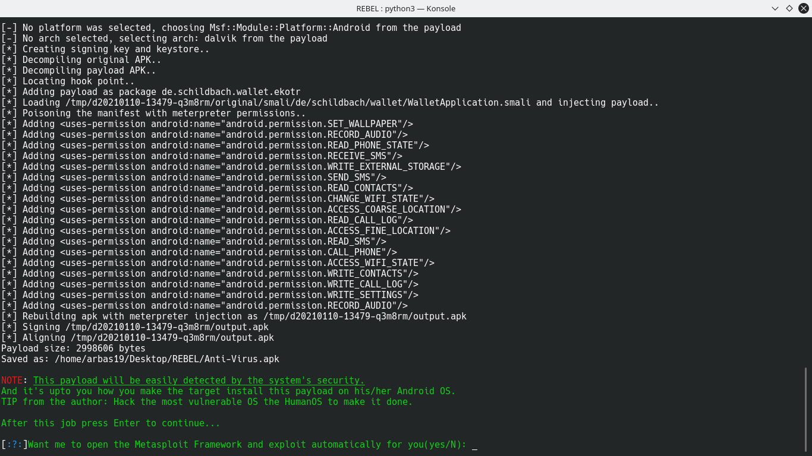
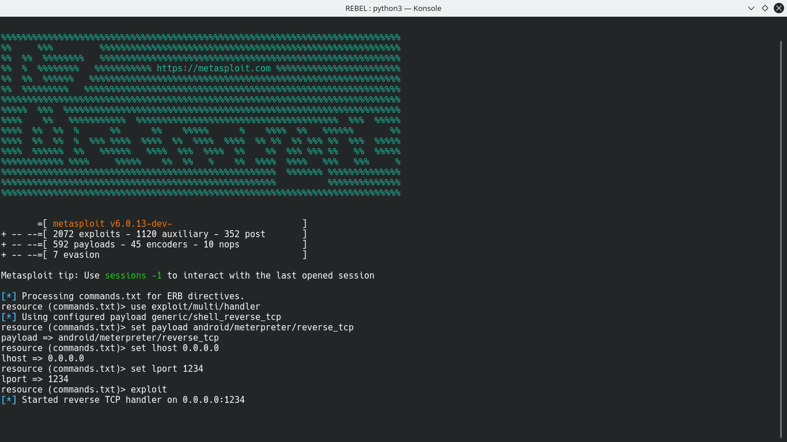

# REBEL

Welcome to  the __REBEL__. This Script is a rebel to the AndroidOS. This Script automates the work of creating android payloads with MSFVenom.
And also it automates the work of exploiting with the MEtasploitFramework.

---

###  Screenshots:






---

###  Requiremnts:

 * Python3
 * MSFVenom
 * MetasploitFramework
 ---

###  Tested on:

 * Kali LINUX
 * SuperX Pro
 * ParrotOS
---

###  Usage:

  #### * For LINUX:
  ```bash
  git clone https://github.com/root-user744/REBEL.git
  cd REBEL
  python3 REBEL.py
  ```
---

### From the Author:
 This program only generates Android payloads, I'm also working on Windows and Macintosh payload generators.
 
 > __Hope you liked my program,<br>
 Thank You.__
